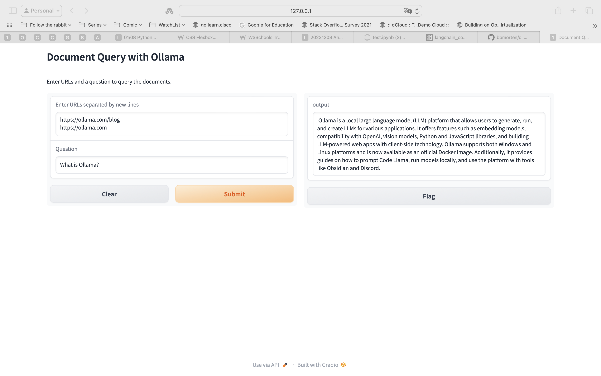

# Installation Steps

## From the video

https://youtu.be/jENqvjpkwmw?si=vUZi5I1xZ1RaAJdX

## Ollama

```shell
ollama pull mistral
ollama pull nomic-embed-text
ollama serve
```

## Create conda environment and run app.py

```shell
mkdir ollama-embedding-test
cd ollama-embedding-test
```

```shell
conda create -n ollama-embedding-test python=3.10
conda activate ollama-embedding-test
pip install langchain langchain-community langchain-core 
pip install gradio
pip install bs4
pip install tiktoken
pip install chromadb
python app.py
```

## Expected Output


```shell
> python app.py
Before RAG

 I'm sorry for any confusion, but the term "Ollama" is not a widely recognized term or concept in various fields such as technology, science, mathematics, or literature. It seems to be an unfamiliar term and could potentially be a typo or a mistake. If you meant to ask about a specific person, organization, or concept, please double-check the spelling and provide any additional context or information that might help clarify your question.

########
After RAG

Number of requested results 4 is greater than number of elements in index 3, updating n_results = 3
 Ollama is a platform that allows users to get up and running with large language models. It provides built-in compatibility with the OpenAI Chat Completions API, enabling users to use more tooling and applications with Ollama locally. Users can download and pull specific models such as Llama 2 or Mistral from Ollama and use them with various libraries like OpenAI Python or JavaScript for chat completions. The platform also provides examples of using Ollama with popular frameworks like Vercel AI SDK and Autogen for building conversational streaming applications and multi-agent applications, respectively. Future improvements under consideration include embeddings API, function calling, vision support, and logprobs. For more information, users can visit the Ollama blog or GitHub page.
> 
```

## UI




```shell
python ui.py

```
